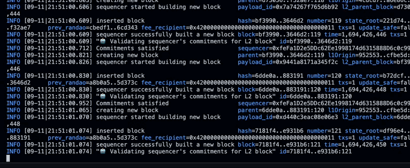

# 🔴 OP Stack Sequencer Commitments

**A hack for the OP Stack introducing sequencer commitments.**



Users that will become sequencers can enter into commitments in the EVM by leveraging [Emily](https://github.com/0xfuturistic/emily), a library for managing commitments on-chain developed for [PEPC-DVT](https://ethresear.ch/t/pepc-dvt-pepc-with-no-changes-to-the-consensus-protocol/16514). This hack is a proof of concept for the [OP Stack](https://stack.optimism.io/), and it is not intended to be used in production.

## Why This Matters
This initiative bridges the capabilities of Layer 1 and Layer 2, ensuring sequencers can make, manage, and fulfill commitments, ultimately fostering transparency and reliability in transaction ordering and powering general-purpose contracting between sequencers and third parties.

## 🌟 Key Features
- **Dynamic Commitments**: Sequencers, as accounts, can enter into commitments in the L1.
- **L2 Enforcement**: Commitments made by sequencers are enforced on L2 blocks, with the logic outsourced to a a predetermined L1 contract.
- **Flexible Design**: Sequencers can make commitments even if they weren't conceived during L2 contract deployment. Because of the EVM, commitments as programs are Turing-complete and can rely on any on-chain data.
- **Solidity Integration**: Commitments are anchored in L1 and stored as tuples of a function and a target, leveraging PEPC-DVT's model. This allows for commitments to be defined in Solidity, and for the EVM to be used as a commitment manager.

## 🛠  Potential Use Cases:

1. **Dynamic Transaction Inclusion**: Facilitate sequencer commitments for the inclusion of transactions with attributes defined after L2 deployment.
3. **Customized Transaction Ordering**: Empower L2 with programmable sequencing policies, offering tailored transaction processing patterns.
4. **MEV Mitigation**: Design strategies in Solidity to mitigate MEV by leveraging commitments to sequence transactions in a particular way.
5. **General-purpose Contracts**: Design and deploy L1-L2 interoperable contracts, facilitating granular interaction between sequencers and third parties, backed by EVM-defined commitments.
6. **Front-Running Prevention**: Leveraging commitments to prevent front-running by committing to including a transaction as the first in the block or with only some specific transactions before it.
8. **Multi-Chain Atomic Operations**: Facilitating atomic operations by sequencing multi-step transactions in a particular order to ensure either successful operations or no transaction at all.
9. **Commitments to Layered Prioritization**: Different categories of transactions (like urgent, premium, standard) can be sequenced based on their priorities.
10. **_Sequencing Services_**: Introducing features such as fairness in transaction ordering to minimize MEV and foster a more equitable transaction environment.

## 🔙 Background Readings
 I recommend checking out this [thread](https://twitter.com/0xfuturistic/status/1697306608722915518) and the piece introducing [PEPC-DVT](https://ethresear.ch/t/pepc-dvt-pepc-with-no-changes-to-the-consensus-protocol/16514). You can learn more about Emily [here](https://ethresear.ch/t/pepc-dvt-pepc-with-no-changes-to-the-consensus-protocol/16514#emily-a-protocol-for-credible-commitments-14).

 You can see a sample commitment for sequencer [here](https://github.com/0xfuturistic/sequencer-commitments/blob/develop/packages/contracts-bedrock/src/commitments/samples/FeeRecipientCommitment.sol). This commitment allows the sequencer to commit to fee recipients for specific blocks.

## ⚙ Technical Blueprint
### In the Rollup Client
The `OnUnsafeL2Payload` function, at the heart of the client's stack (`op-node`), is responsible for processing new payloads. This function now integrates a call that validates payloads for commitment satisfaction. The logic for these commitments is implemented in the EVM by Emily.

```go
// In op-node/node/node.go
func (n *OpNode) OnUnsafeL2Payload(ctx context.Context, from peer.ID, payload *eth.ExecutionPayload) error {
    ...
    // Commitments check
    if err := n.validateCommitments(ctx, payload); err != nil {
        return err
    }
    ...
}
```

```go
// In op-node/node/pepc.go
func (n *OpNode) validateCommitments(ctx context.Context, payload *eth.ExecutionPayload) error {
    ...
    // Convert payload to bytecode
    payloadBytes, err := n.encodePayload(payload)
    if err != nil {
        return err
    }

    // Invoke the Screener
    satisfied, err := instance.Screen(nil, n.runCfg.P2PSequencerAddress(), *n.target(), payloadBytes)

    if err != nil {
        return err
    }
    if !satisfied {
        return errors.New("ScreeningFailed")
    }
}
```

### In the L1
Leveraging Emily's [Screener contract](https://github.com/0xfuturistic/emily/blob/main/src/Screener.sol), we filter the payloads that don't satisfy the sequencer's commitments. The rollup's system config inherits from this contract and implements a `screen` function responsible for checking whether the commitments of the sequencer are satisfied by the payload being screened. Screener does this by invoking the `areAccountCommitmentsSatisfiedByValue` function of a [CommitmentManager contract](https://github.com/0xfuturistic/emily/blob/main/src/CommitmentManager.sol), which is responsible for storing and managing commitments.

```solidity
contract Screener {
    /// @notice Checks if the account's commitments are satisfied by the value being written.
    /// @param account The account that is writing the value.
    /// @param target The target to which the value is being written.
    /// @param value The value being written.
    /// @return True if the account's commitments are satisfied by the value being written, false otherwise.
    function screen(address account, bytes32 target, bytes memory value) public view virtual returns (bool) {
        return commitmentManager.areAccountCommitmentsSatisfiedByValue(account, target, value, block.timestamp);
    }
}
```
It's also worth noting that even though they are constrained in their behavior by their commitments, a sequencer may choose not to provide their signature in the first place. So the sequencer can't be forced to act in a particular way. Rather, we prevent them from doing so in specific ways (i.e., in ways that violate their commitments).

For any questions, feel free to reach out via [Twitter](https://twitter.com/0xfuturistic/).


## 🗺 Road Ahead
- Expand the variety of commitments provided as a sample.
- Enhance and solidify the tests.
- Comprehensive documentation to accompany every feature.

## 🙌 Contribute & Feedback
Your insights can shape the future of this initiative. Feel free to [raise an issue](https://github.com/0xfuturistic/sequencer-commitments/issues/new), suggest a feature, or even fork the repository for personal tweaks. If you'd like to contribute, please fork the repository and make changes as you'd like. Pull requests are warmly welcome.

For questions and feedback, you can also reach out via [Twitter](https://twitter.com/0xfuturistic/).

## 📜 License
This project is licensed under the MIT License. For more details, please see [LICENSE file](https://github.com/0xfuturistic/sequencer-commitments/blob/develop/LICENSE).